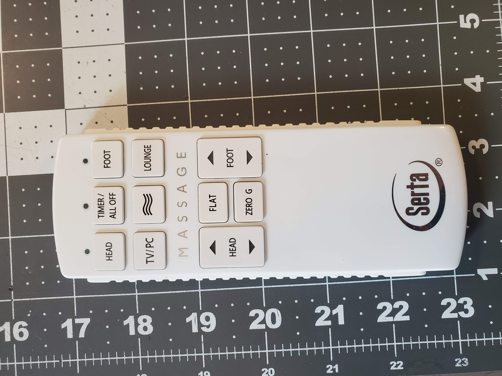
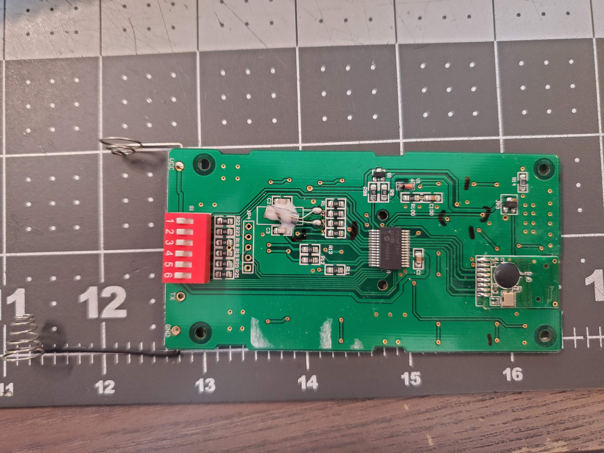

# SmartThingsSertaBedControl
Control Serta adjustable bed from SmartThings and Alexa

I'm not 100% sure how many models of Serta Adjustible beds this is compatible with.
I believe it should work with:
Serta Motion Perfect 1.0 (white, rectangular remote. DIP switchs on remote and controller box for bed)
Remote looks like this: http://www.saltlakemattress.com/resources/thSerta%20Motion%20Perfect%201.0%20Remote%20Details.jpg

The easy way to check if you have the same device is to open up the remote. Take off the battery cover. This project uses a remote that has 6 DIP switches, with the FCC ID: WKZSFDY0502

Pictures:

Configuration:

Setup your Photon. Add 3 files to your Particle project Code in the code editor:
CC2500_val.h
CC2500_REG.h
Particle_BedControl.ino
https://build.particle.io/build

Configure your photon Wiring. This would also work with an arduino.
You will need to connect a CC2500 2.4ghz transceiver. See Code for wiring Pins. Need to connect all 4 wires (MISO, MOSI, CLK, CSN).
CC2500 modules can be found for a few dollars on ebay/aliExpress. They are very small, smaller than an arduino or Particle.

This should get your device to the point where you can send it commands and manipulate the bed :)

SmartThings:
Create a new Device Handler in the SmartThings IDE 
https://graph.api.smartthings.com/ide/devices

see sample code in PhtoBedControl_SmartThingsDeviceHandler.txt

Create new Device in SmartThings that uses the new device handler.

Assuming you've gotten your smartThings setup with Alexa, you can now add this new device to alexa.
The smartThings device handler is defined as a switch. Alexa will allow you to use "ON" and "OFF" commands. 

The configuration for on and off, the switch states that alexa understands are defined as:
def on: Lounge
def off: Flat
You can change the default "on" state by changing the def on: state. These are the commands sent to the Particle device.

You'll need to setup your particle devices ID and your access key. These could probably be setup as configuration items for a device, instead of hard coded in the Device handler. In this case, only one particle can be controlled by the device handler. See SmartThings examples on how to setup preferences for each device, so that the device handler could be re-used to control many Particles.

Once setup in Smart Things, you'll see your device and all of the bed remote control buttons. In this example, The 'vibration' option buttons were not used. The CC2500_val.h file has the button codes defined, but are not configured in the particle ExecBedCmd function.

Once connected to Alexa/Amazon Echo, the following commands (and probably some variation of) are available:
"Alexa, turn on the bed"
"Alexa, turn off the bed"

Amazon Alexa sees this device as a normal switch. Any switch commands should work.

I believe there are ways to expand this device so that alexa can support any code word for the particle device. If you find this code useful and add those features (or other features) please let me know.
